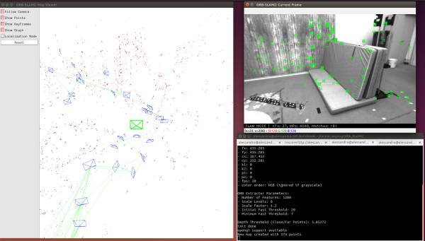
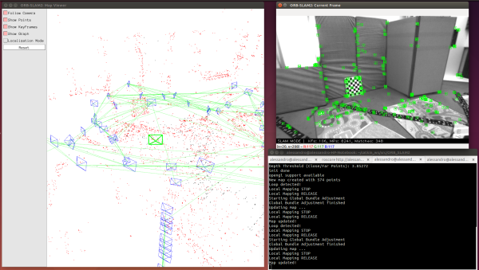
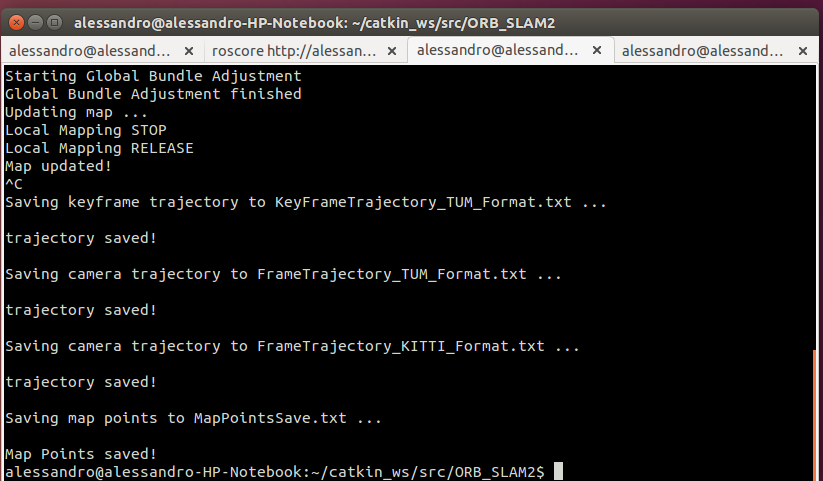
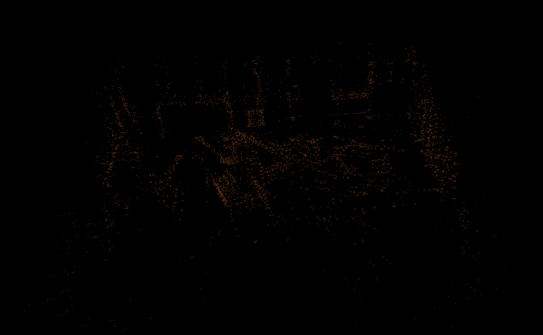
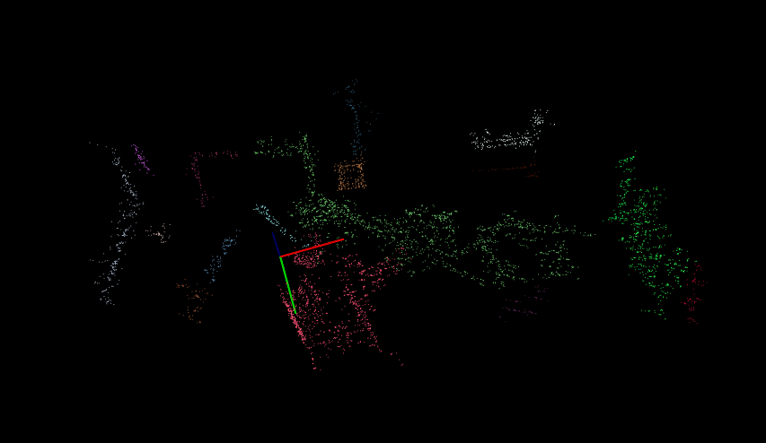

# homework3

University of Verona - IT department - Computer Science

## Description
In this homework of Laboratorio Ciberfisico I use a modified version of ORBSLAM2 (https://github.com/raulmur/ORB_SLAM2) to make a 3d reconstruction and save that in a point cloud (pcd file).
I used PCL library to convert the map by txt to pcd file and to segment the scene with a clustering algorithm

## Clone repository
```
git clone https://github.com/aleriboni/homework3.git
```

## Clone modified version of ORB_SLAM2
```
git clone https://github.com/aleriboni/ORB_SLAM2.git
```

## Realization

I added a function 'SaveMapPoints' into ORBSLAM2 to save the 3d reconstruction genereted by SLAM alghoritm.
This function save in a .txt file the coordinates of points and I used 'create_pcd.cpp' to convert that into a .pcd file.
After that, I used 'clustering.cpp' to cluster the cloud based on the Euclidean distance.
I tried different configurations for 'setClusterTolerance' and 'setMinClusterSize' but, in my opinion, for having the best result to cluster the 3d reconstruction of the rosbag V1_01_easy.bag from the EuRoC dataset is set the minimum cluster size of 40 and the tollerance of 0.15.

## Compile:

After cloning git going to "homework3" directory and use this command:
```
mkdir build
cd build
cmake ..
make
```
You will find the executables in bin/

## Save map by a .bag file

If you want to try to reconstruction by V1_01_easy.bag (use three different terminals):
```
roscore
```
```
rosrun ORB_SLAM2 Stereo Vocabulary/ORBvoc.txt Examples/Stereo/EuRoC.yaml true
```
```
rosbag play --pause V1_01_easy.bag /cam0/image_raw:=/camera/left/image_raw /cam1/image_raw:=/camera/right/image_raw
```
When .bag file is finished, press CTRL+C to exit and save the map.

You can download V1_01_easy.bag here:
http://robotics.ethz.ch/~asl-datasets/ijrr_euroc_mav_dataset/vicon_room1/V1_01_easy/V1_01_easy.bag






Press CTRL+C to save .txt map and exit:



## Convert map in my_pointcloud.pcd
Copy the map into /homework3/bin and move there:
```
./create_pcd MapPointsSave.txt
```




## Cluster the .pcd file
```
./clustering my_pointcloud.pcd
```




## Author

Alessandro Riboni | alessandro.riboni@studenti.univr.it

## Disclaimer

homework3 is provided without any warranty about its usability. It is for educational purposes and should be regarded as such.
